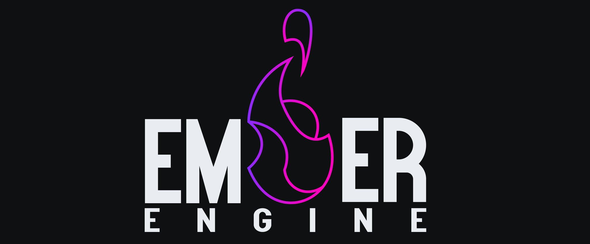

## Overview
Ember engine is a project that I started in order to dive into Engine/Graphics programming. \
Although it lacks in features compared to commercial and other open source solutions, it serves as an excellent base
for learning and experimenting with rendering and engine concepts.

The goal is to extend this into a feature-complete graphics engine, including an editor and the basic tools needed to create a game.

## Platforms
* Windows
* OS X (AArch64)

Only 64-bit targets are supported.

## Dependencies
The following libraries are used (and are already included):
* **GLFW** is used for managing the running windows.
* **OpenGL** (4.1) is the main graphics API (may be replaced by a modern API/RHI).
* **GLM** is used as the base mathematics library (may be replaced with a custom solution in the future).
* The project uses the **Premake** (v5.0.0-beta2) build system.

Precompiled Premake binaries for Windows and OS X are also included.

A **Python** script is used to interact with **Premake** and therefore must be present in your system. \
If you want to avoid installing it, you can manually run premake and build the project (see  `generate_project.py`).

## Build
1. Download/Clone the code/repository.
2. Open a terminal and change the working directory to the project root.
3. Execute the project generation python script: `python ./generate_project.py`

There is also a command to clean the generated solution/projects:
1. `python ./generate_project.py clean` 

## Feature List
- [x] Textures (diffuse, normals, etc.) [not fully implemented]
- [ ] Shadows
- [x] Cubemaps
- [x] Model Loading
- [ ] Deferred Rendering
- [x] Physically Based Rendering
- [x] Image Based Lighting
- [x] Blinn-Phong
- [x] Multiple world lights
- [ ] Order Independent Transparency
- [ ] Text Rendering
- [ ] Raytracing
- [x] Editor (ImGui)

## License
The MIT License (MIT) 
